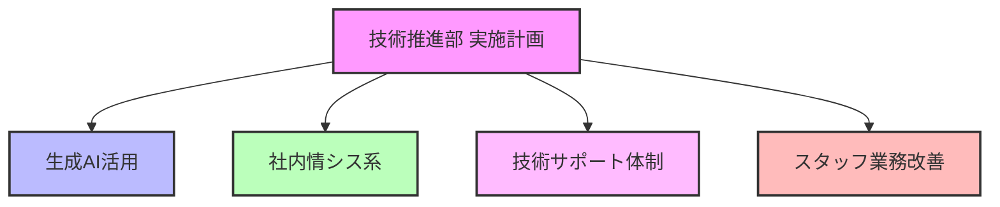
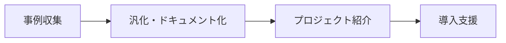
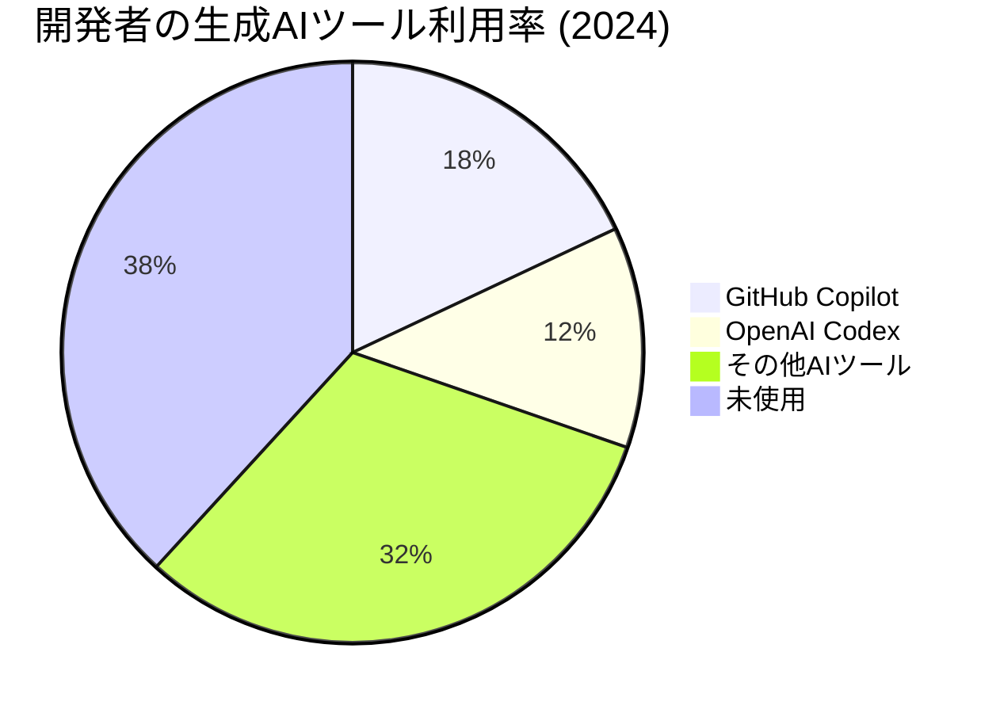
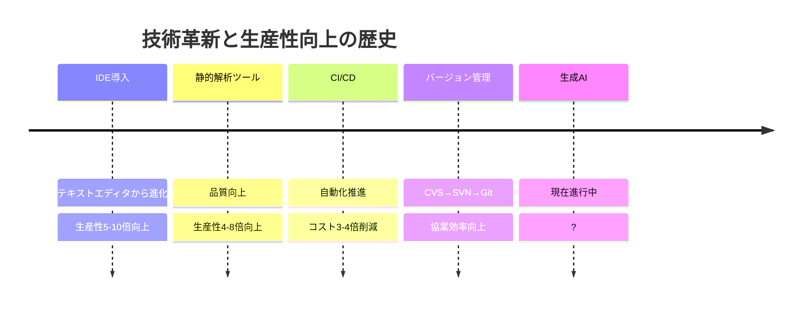
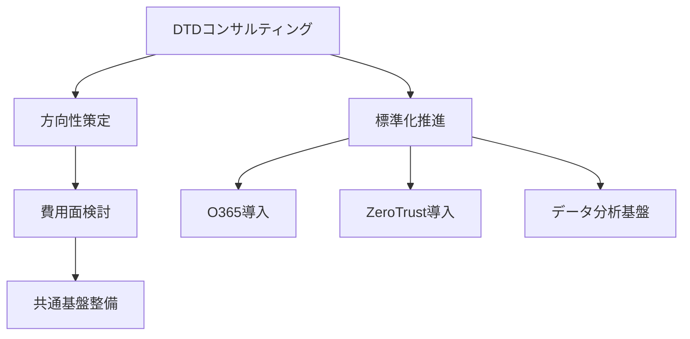
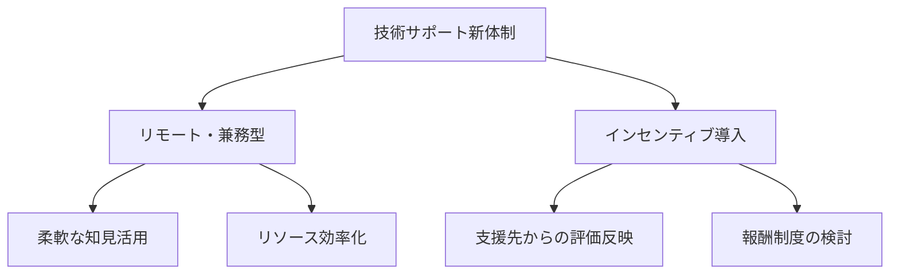
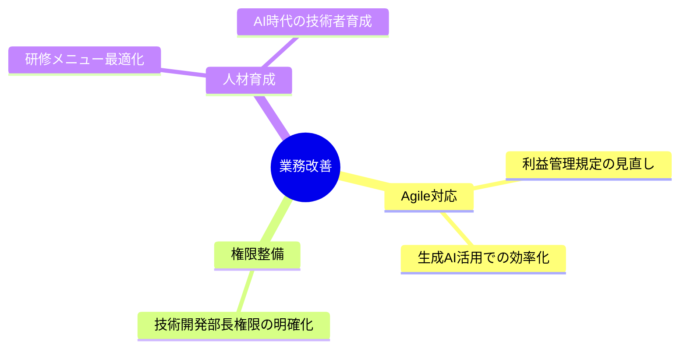
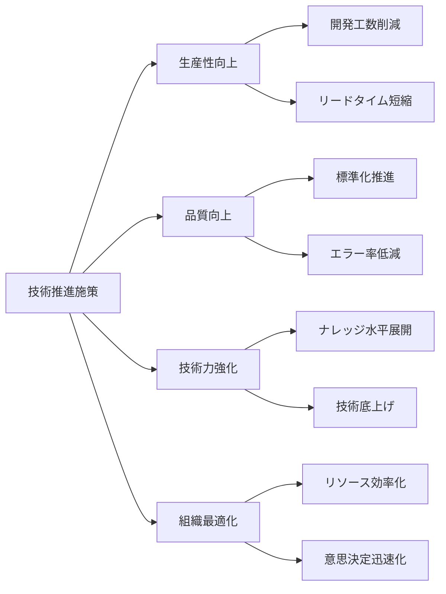

# 技術推進部 2025年度実施計画
## 「技術革新による生産性向上と組織強靭化に向けて」

---

## 概要

本資料は「技術推進2025.pptx」をベースに、技術推進部が取り組む4つの主要分野とその実施計画をまとめたものです。

---

## 対象分野



---

## 1. 生成AI（特にAI-IDE）

### 基本方針



### 実施アプローチ
- **柔軟な導入支援**: プロジェクト特性に合わせたツール選定を支援
- **成功事例の横展開**: 実績あるプロジェクト（榎本氏、住原氏、小山氏）からのナレッジ収集
- **現場主導**: 上からの強制ではなく、現場のニーズに応じた導入支援

---

## 生成AI推進の背景

### 市場動向


- Stack Overflowの2024年調査：61.8%の開発者がAIツール使用（前年比+18%）

### NTTデータの現状
- 補完としての利用に留まる状況
- 商用システムのバグ修正では人間の判断が依然必要
- 日本特有の受注生産型案件では特殊処理が多く、AI単独での対応は困難

---

## 生成AI活用の展望

### 活用シナリオ

| 対象者 | 活用方法 | メリット |
|--------|----------|----------|
| 有識者 | コード生成・レビュー補助 | 開発速度向上、品質向上 |
| 経験浅いメンバー | ペアプログラミング的活用 | 即時回答による学習効率向上、有識者の負担軽減 |

### 歴史的展開との類似性



---

## 2. 社内情シス系

### 実施方針



### 共通基盤と個別ツールの取り扱い
- NTC-G共通利用ツールの整理
- 生産性・品質向上に資する個別ツールは制限しない
- 対外的な窓口の一本化（ルール策定）

---

## 社内情シス推進項目

### DTDコンサル連携事項
- O365導入とメールシステムのExchange移行
- ゼロトラスト環境の構築
- 統合データ分析基盤の整備（Excel依存からの脱却）

### 技術推進部主導事項
```mermaid
gantt
    title 技術推進部主導項目 実施スケジュール
    dateFormat  YYYY-Q
    section 基盤整備
    過去PJ情報収集      :a1, 2025-Q1, 2Q
    セキュリティポリシー整理  :a2, 2025-Q1, 3Q
    開発環境セキュリティ対策  :a3, 2025-Q2, 2Q
    ガイドライン更新    :a4, 2025-Q3, 2Q
    section 今後検討
    技術系資格情報見える化  :b1, 2025-Q3, 2Q
    技術プロファイリング  :b2, 2025-Q4, 2Q
    外部エンジニア交流  :b3, 2025-Q4, 2Q
```

---

## 3. 技術サポート体制

### 現状と課題
- 技術の多様化による個人での対応限界
- 常駐型サポート体制の非効率性
- リモートサポートへの移行ニーズ

### 対応方針


### 参考モデル
- NTTデータ技統本の取り組み：年単位の継続支援に20%増額制度

---

## 4. スタッフ業務改善

### 主要検討項目



### 人事研修メニュー見直し
- 現行メニューは高評価
- コード作成を前提とした構成
- 今後のAI活用に合わせた調整検討

---

## まとめ：技術推進ロードマップ

```mermaid
gantt
    title 技術推進部 2025年度 実施ロードマップ
    dateFormat  YYYY-Q
    section 生成AI活用
    事例収集          :active, a1, 2025-Q1, 1Q
    ナレッジ体系化    :a2, after a1, 1Q
    導入支援体制確立  :a3, after a2, 2Q
    section 社内情シス
    DTDコンサル       :b1, 2025-Q1, 1Q
    共通基盤整備      :b2, after b1, 2Q
    ポリシー策定      :b3, after b2, 2Q
    section 技術サポート
    体制検討          :c1, 2025-Q2, 1Q
    インセンティブ設計:c2, after c1, 1Q
    実証実験          :c3, after c2, 2Q
    section スタッフ改善
    規定見直し        :d1, 2025-Q1, 2Q
    研修メニュー検討  :d2, 2025-Q3, 2Q
```

---

## 期待される効果



---

## ご審議ください

- 生成AI活用の推進方針
- 社内情シス関連の優先度
- 技術サポート体制の刷新案
- スタッフ業務改善の範囲
